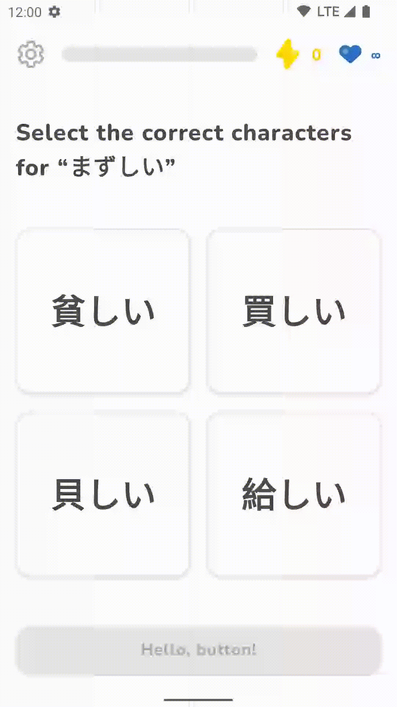

# Custom theme playground

A Jetpack Compose implementation of a completely custom design system, without using any Material code.

The sample code shows a number of techniques, some of which are derived from the Compose Material package.

This repository is a practical showcase of what's covered in my "Compose beyond Material" talk; you can find more information, including recordings,
slides, and references, [on my website](https://go.sebastiano.dev/compose-material-2022).



## Disclaimer

This sample implements part of the [Duolingo design language](https://design.duolingo.com/identity/color).

I am **not** associated with Duolingo in any way, and am just using their design system as a reference.

Why did I choose to implement their design system? First, I am a fan of their product 🤩 Then, I think their design system looks very pretty and has
significant enough differences from Material to make sense implementing "from scratch".

So, please, don't give me any credits for the design. Take this as a tribute 😁

### A note on the code

The goal of this repo is to display how the skeleton of a custom design system implementation would look like. Its code quality can be varying, and
there are corners cut and missing performance improvements for the sake of briefness.

**It is not production-ready code**.

You'll also find that similar things have been implemented in different ways; that is intentional, to show how you can obtain the same effect in
differing ways.

However, if you were to write production code, you would want to unify the logic and reuse as much as possible, choosing the most efficient way.

### License

The code is released under the Apache 2.0 license:

```
Copyright 2022 Sebastiano Poggi

Licensed under the Apache License, Version 2.0 (the "License");
you may not use this file except in compliance with the License.
You may obtain a copy of the License at
http://www.apache.org/licenses/LICENSE-2.0
Unless required by applicable law or agreed to in writing, software
distributed under the License is distributed on an "AS IS" BASIS,
WITHOUT WARRANTIES OR CONDITIONS OF ANY KIND, either express or implied.
See the License for the specific language governing permissions and
limitations under the License.
```
